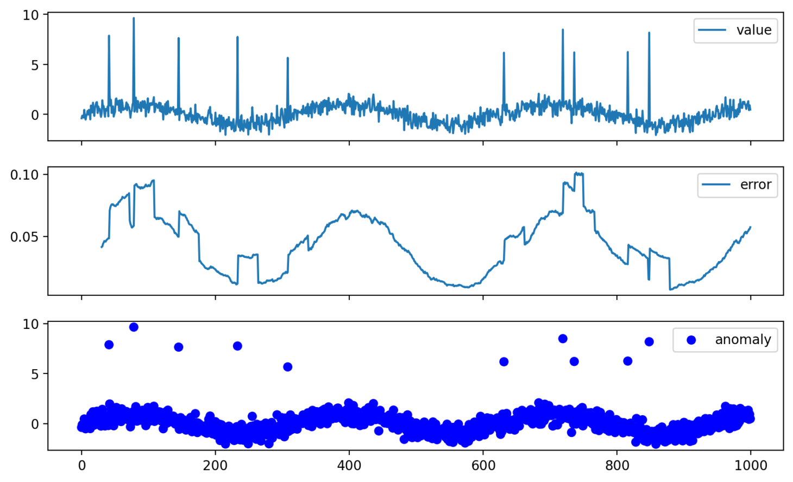

# Time-Series Anomaly Detector

A simple end-to-end example of detecting anomalies in a univariate time series using a PyTorch LSTM autoencoder and visualizing results in a Streamlit dashboard.

---

## 🚀 Features

- **Synthetic data generator**: builds a noisy sinusoidal series with random “spikes”.
- **LSTM Autoencoder**: learns to reconstruct normal sequences, flags outliers by reconstruction error.
- **Thresholding**: computes a data-driven anomaly threshold (mean + 3·std of train errors).
- **CLI scripts**:  
  - `train.py` — generate data & train the model  
  - `detect.py` — compute reconstruction errors & label anomalies  
- **Streamlit dashboard**: interactive charts of original series, reconstruction error, and anomaly markers.
- **Dockerized**: one-step build & launch.

---

## 📊 Results Preview


---

## 🔧 Prerequisites

- Python 3.8+  
- (Optional) Docker & Docker Engine

---

## 🛠️ Installation

1. **Clone the repo**  
   ```bash
   git clone https://github.com/ion-linti/ts-anomaly-detector.git
   cd ts-anomaly-detector
   ```

2. **Create & activate a virtual environment**  
   ```bash
   python3 -m venv venv
   source venv/bin/activate    # Linux/macOS
   # .\venv\Scripts\activate  # Windows PowerShell
   ```

3. **Install dependencies**  
   ```bash
   pip install --upgrade pip
   pip install -r requirements.txt
   ```

---

## 📈 Training

```bash
python train.py
```

---

## 🔍 Detection

```bash
python detect.py
```

---

## 📊 Streamlit Dashboard

```bash
streamlit run app.py
```

Open http://localhost:8501 and click to refresh plots.

---

## 🐋 Docker Usage

```bash
docker build -t ts-anomaly-detector .
docker run --rm -p 8501:8501 ts-anomaly-detector
```

---

## 🤝 Contributing

Fork → branch → PR → merge.

---

## 📄 License

MIT License
